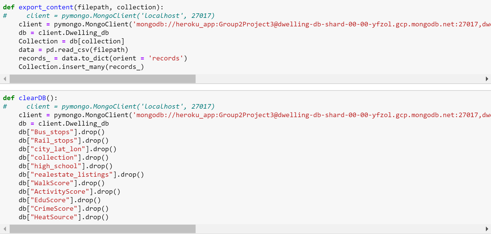
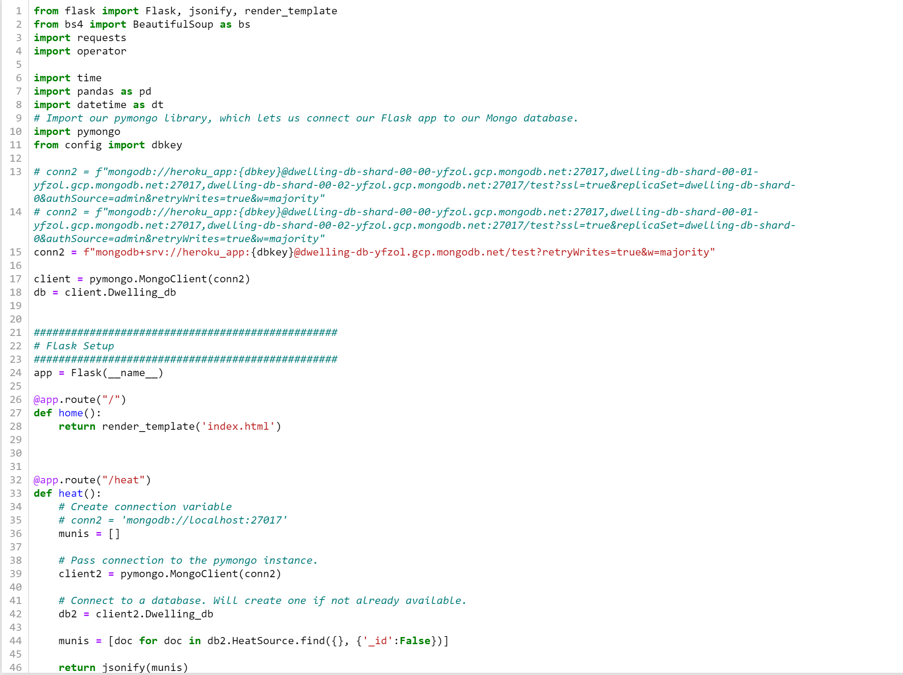
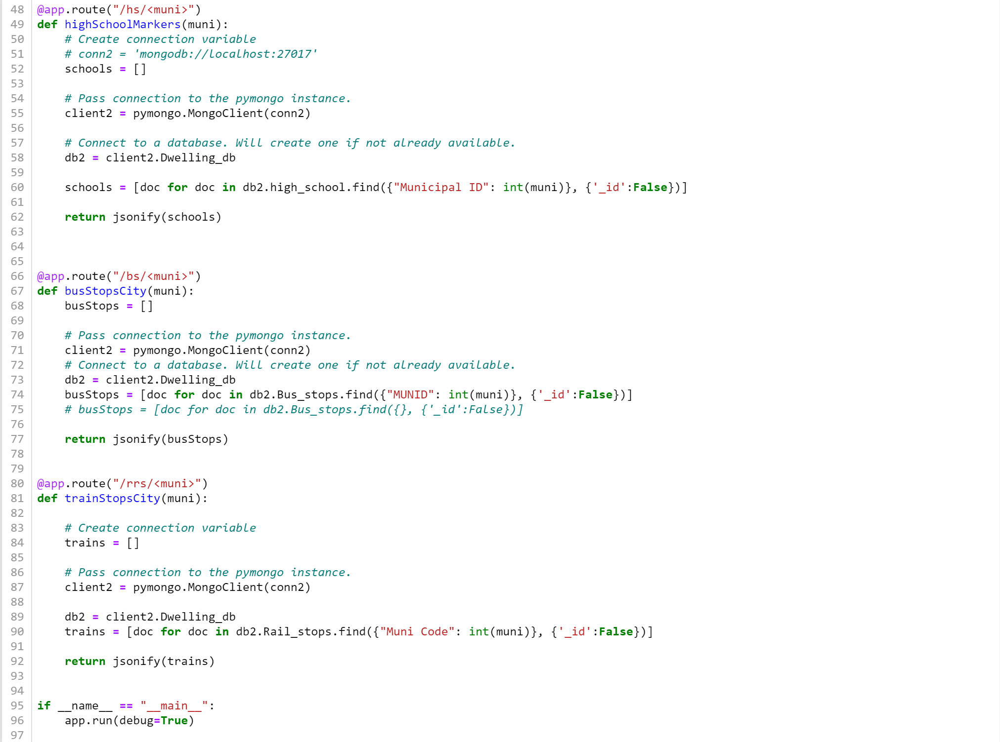
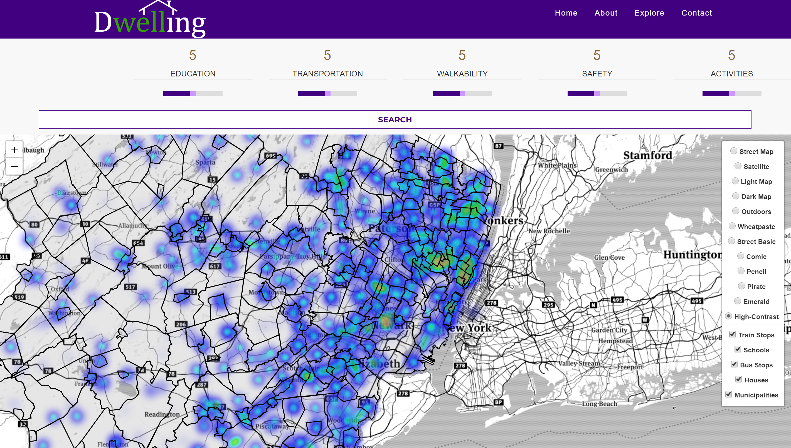
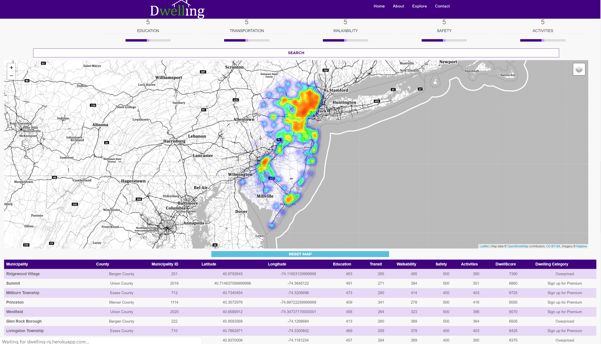
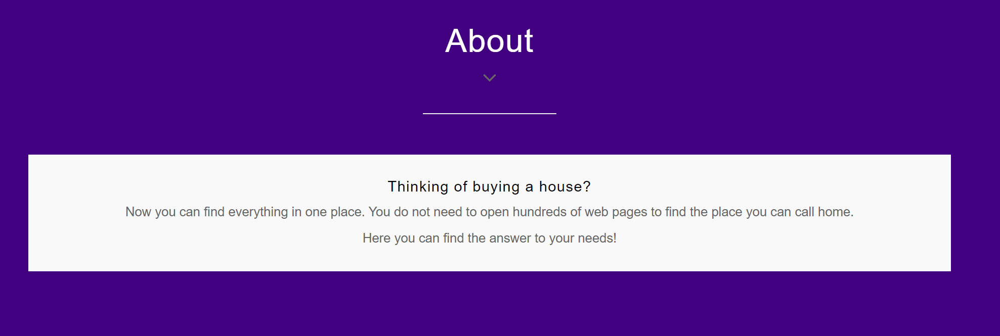
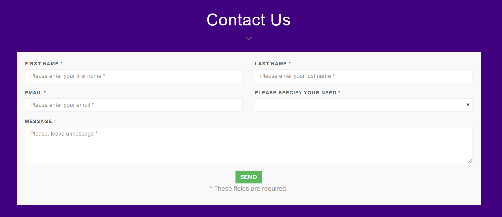

# DWELLING: A tool for potential home buyers in NJ

### Tool: [View Dwelling App Online](https://dwelling-nj.herokuapp.com/)

Members: 

* @asrivasts - Anu Srivastava
* @Bulinche - Luis Hernandez
* @oik01 - Omar Kreidieh
* @mariavpatino - Maria V. Patiño

[Final Presentation in Prezi](https://prezi.com/view/fDbqnYbU326RtIwsHeIm/)

 

## ABOUT

A tool that helps potential home buyers make a decision on the area where they should search for the property according to their needs. The application scores municipalities based on multiple factors like schooling,  transportation, walkability, safety, and activities. A user may select the priorities in order to receive a suggested area to meet their needs.

A machine learning algorithm uses data sources to predict fair prices per each area and identifies over price, lower price and fairly price locations.

Technology Used:
- Python
- HTML/CSS/Bootstrap/Javascript
- Flask
- MongoDB
- Heroku  

 

## INSTALL

* Clone from Github page
* In terminal or gitBash, run a git clone in desired location to save app.
* Run an npm install to download required packages.

 

## PROCESS
### Dataset

Data Collected:

* Avg House Prices
* Taxes Rates
* Crime Score
* Schools Scores (Determined by Ranking)
* Transportation
* Walkability
* Activities
* Demographics:
    * Race
    * Labor force
    * Household Income
    * Poverty
    * Population Density
    * Others

All the data collected had to be normalized, that is, go through a process where the data was organized in such a way that they all had the same key id, in this case, they were the municipality and its code.

### Project Steps:

1. Get data from reliable sources and normalize it.
2. Combine all the data in MongoDB.
3. Connect the data using Flask, bootstrap, d3, mapping etc.
4. Deploy MongoDB app to Heroku.
5. [View Dwelling App Online](https://dwelling-nj.herokuapp.com/)
6. Find the perfect area to live!
 

 

## GETTING THE DATA

Data extraction: Research process in different sources.

 

## STORING THE DATA

### Database Creation
The data extracted (average house prices, school data, transportation data, walkability, crime score, activities score) is stored in collections in the Dwelling_db database in MongoDB online.  

 

## FLASK 
We used a Javascript/HTML/CSS/Bootstrap frontend with a Flask backend server written in python.  
The backend is comprised of:
* Renders the web page.
* Education Score viewing requests sent from the interface.
* Transportation Score display requests sent from the interface.
* Walkability Score visualization requests sent from the interface.
* Crime Score viewing requests sent from the interface.
* Requests to view Activities Score sent from the interface.  

  

## FRONT-END (Visualizations)
Home Page: 

 

Map with the filters: 

 

Table with the municipalities recommendations:  

 

### Additions:
* About: 

 

* Contact Us Format: 

